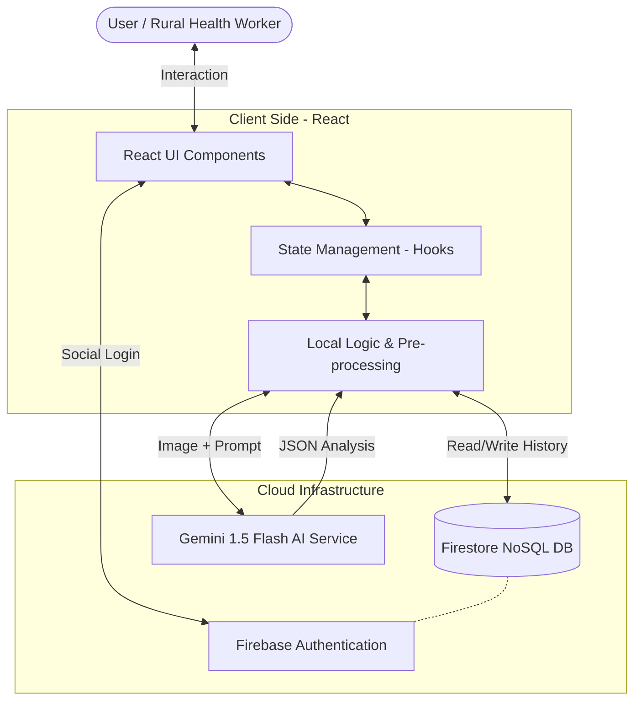
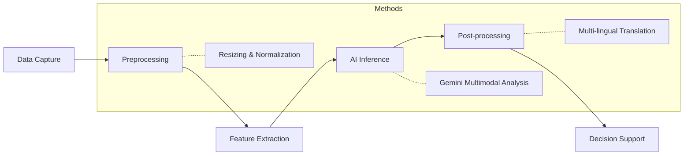
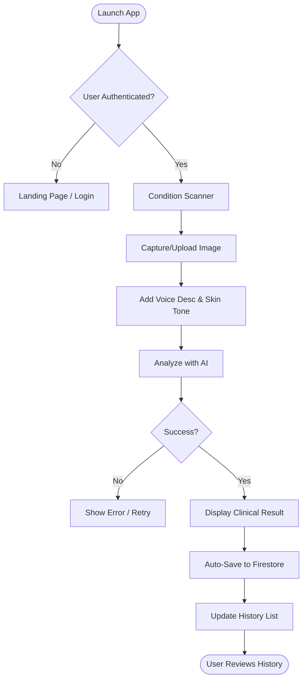

# DermAl Project Documentation

This document outlines the technical architecture, system flow, and methodology used in the DermAl application.

## 1. System Architecture Diagram

The application follows a modern serverless architecture, utilizing React for the interface, Firebase for data persistence and authentication, and Gemini AI for specialized dermatological analysis.

---

## 2. System Flow

1.  **Input Acquisition**: User uploads or captures an image of the skin condition via the React UI.
2.  **Context Enrichment**: User provides voice-to-text or typed description and selects the patient's skin tone (Fitzpatrick scale).
3.  **Processing**: The frontend packages the image (Base64) and context metadata.
4.  **AI Analysis**: The request is sent to the Gemini 1.5 Flash model with a specialized medical prompt.
5.  **Multi-Lingual Formatting**: The AI generates a structured JSON response including localization (Hindi, Tamil, etc.) and clinical recommendations.
6.  **Storage**: The result is pushed to the user's private Firestore sub-collection for history tracking.
7.  **Output**: The UI displays a detailed report with severity indicators and localized advice.

---

## 3. Methodology Diagram

The methodology follows the standard medical image analysis pipeline adapted for AI.

---

## 4. Logical Flowchart

## 5. Technology Stack Summary

| Layer | Technology Used |
| :--- | :--- |
| **Frontend** | React 18, Tailwind CSS, Lucide Icons |
| **AI Model** | Google Gemini 1.5 Flash (Multimodal) |
| **Database** | Firebase Firestore (Real-time NoSQL) |
| **Auth** | Firebase Authentication (Google Login) |
| **Deployment** | Cloud Run / Vercel-style Containerization |
| **Languages** | TypeScript, Markdown |
